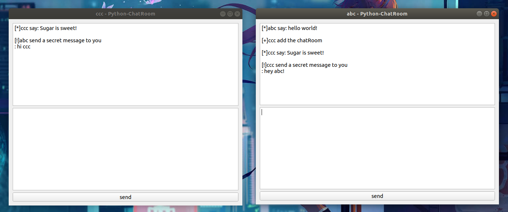

# QT-Python-ChatRoom
* v2.2.1
* 一个简单的Python-GUI聊天室
* 使用Python pyside2库
* 基于UDP协议，实现以下功能
  * 用户注册
  * 用户登录
  * 公聊
  * 私聊
* HDU Python网络编程课程设计 实验二

软件截图



## Usage

1. 首先启动服务端 

```python
python3 server.py 127.0.0.1 port 
```

2. 启动客户端

```python
python3 client.py
```
例如
```python
python client.py
```

3. 使用

既然是GUi了应该摸索一下就能使用了XD

